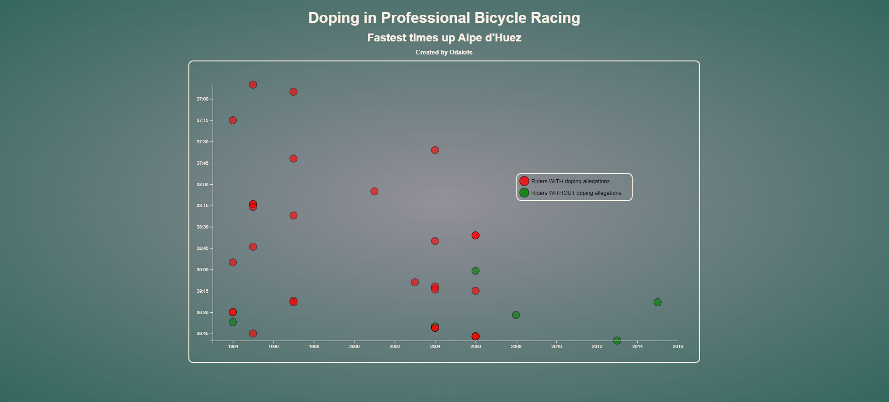

# FCC - Scatterplot Graph


Live demo of **[Scatterplot Graph](https://codepen.io/odakris/full/XWyJMRb)**

## Description

This is a Scatterplot Graph of fastest times up Alpe d'Huez for professional bicyle racing.

This project is part of the **[freeCodeCamp](https://www.freecodecamp.org/learn/data-visualization/data-visualization-projects/visualize-data-with-a-scatterplot-graph)** Data Visualization projects certification.

<p align="center">
  
</p>

## Instructions

Clone this repository and launch :

```
index.html
```
